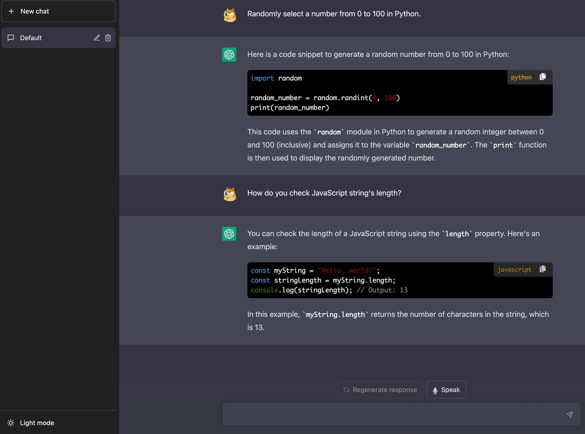
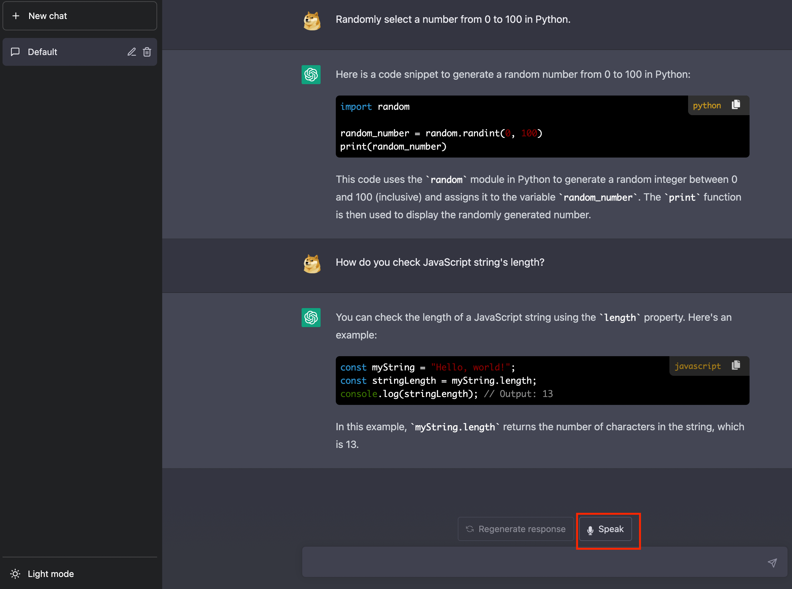
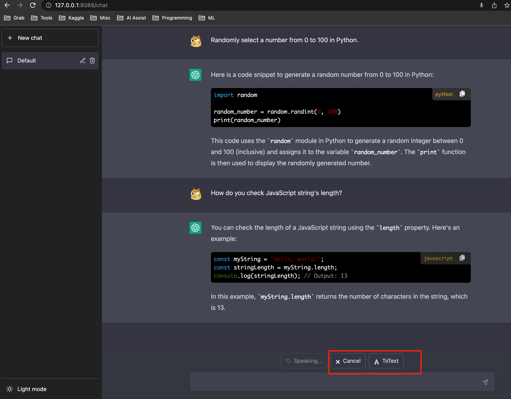

# A ChatGPT Web App with Voice Input Based On OpenAI's ChatCPT and Wishper
ChatGPT Web App with Voice Input

## Updates

### 2023-03-07

* Add voice suppot

### 2023-03-06

* Render markdown using JS lib
* Save chat history to `sessionStorage` to prevent loss after refreshing
* Fix some browser compatibility issue by rewriting some functions in highlightjs-badge.js with jQuery
* Shift + Enter (⇧+⏎) to newline in the chatbox

## Usage

* install dependecies with `pip install -r requirements.txt`
* visit https://platform.openai.com/account/api-keys to get/create your API KEY
* set env variable: `export OPENAI_API_KEY=<your_openai_key>`
* start server: `python main.py`
* visit http://127.0.0.1:8088/chat and enjoy!

### Voice Input

#### Speaking
click speak to record your voice

#### Cancel or ToText

* Click `ToText` to covert your recording to text then the text will be added to your chat window for editing (this is to ensure the converted text is exactly what you want, so you're not wasting money to ask the wrong question)
* Click `Cancel` to cancel your recording