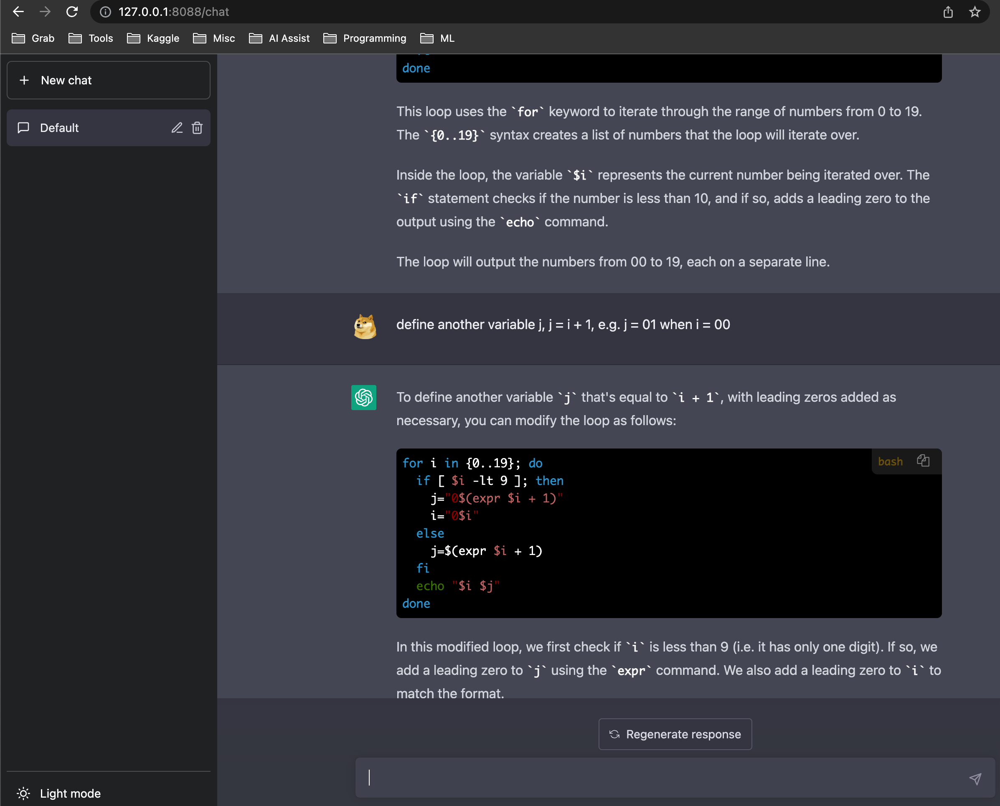

# A ChatGPT Web App Based On OpenAI API
ChatGPT Web

## Usage

* install dependecies with `pip install -r requirements.txt`
* visit https://platform.openai.com/account/api-keys to get/create your API KEY
* set env variable: `export OPENAI_API_KEY=<your_openai_key>`
* start server: `python main.py`
* visit http://127.0.0.1:8088/chat and enjoy!